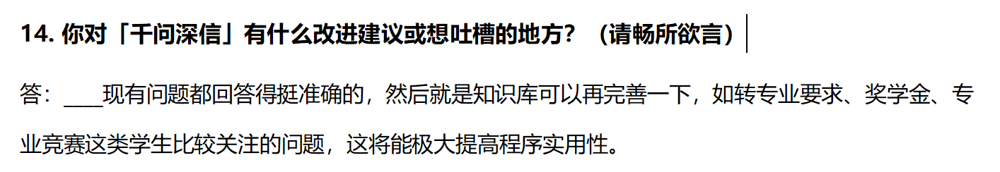
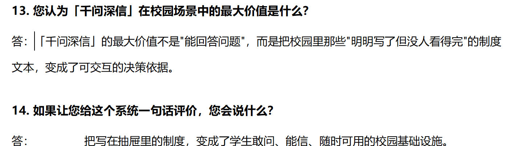
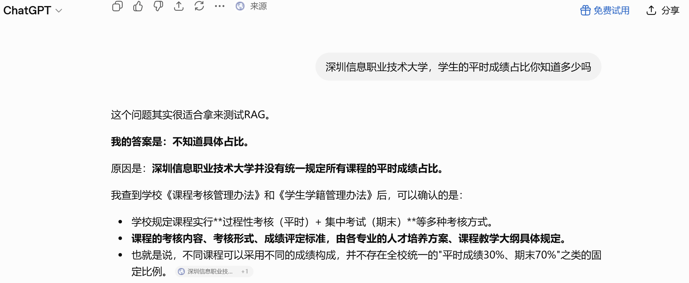

# 🏫 千问深信 — 校园智能问答助手

> **Qianwen Shenxin · Campus RAG Assistant**
>
> 基于开源 [RAG-Skeleton](https://github.com/Rhine9527123/RAG-Skeleton) 为骨架，采用Trae IDE为开发工具进行二次开发，专为校园场景打造的智能问答系统。
>
> 📌 **2026 火山杯参赛作品**（深圳信息职业技术大学 × 字节跳动）

<p align="center">
  <a href="https://www.trae.ai"></a>
  <a href="https://www.python.org"></a>
  <a href="https://fastapi.tiangolo.com"></a>
  <a href="https://streamlit.io"></a>
  <a href="https://modelcontextprotocol.io"></a>
  <a href="https://www.llamaindex.ai"></a>
  <a href="LICENSE"></a>
</p>

---

<p align="center">
  🚀 <strong>在线体验</strong>：<a href="https://www.qwsuit.site">www.qwsuit.site</a> &nbsp;|&nbsp; 
  📖 <strong>基础骨架</strong>：<a href="https://github.com/Rhine9527123/RAG-Skeleton">RAG-Skeleton</a>
</p>

---

## 📖 项目简介

**痛点：** 每年开学，学生面临三大难题——

| 痛点 | 表现 | 后果 |
|------|------|------|
| ❌ **信息太散** | 校园信息分散在 10+ 份文档（招生简章、教学指南、收费文件、生活指南…） | 找一条答案要逐份翻阅，耗时数十分钟 |
| ❌ **通用模型答不了** | 问「深信大 A 食堂几点开」，ChatGPT 编造或说不知道 | 答案不可信，无法用于真实场景 |
| ❌ **传统搜索不够用** | 关键词搜索只返回片段，复合问题更束手无策 | 学生仍需自己拼凑答案 |

**我们的方案：** 将学校 10+ 份官方文档构建为智能知识库，学生用自然语言提问，系统自动检索、精准回答，每条答案标注来源文档。

---

## ✨ 核心亮点

### 1️⃣ 复合问题拆分（最大差异化）

> 通用大模型做不到，普通 RAG 也做不到——**我们做到了**。

**示例：** 用户问「食堂有几个？哪个离男生宿舍最近？哪个最好吃？」

| 系统 | 表现 |
|------|------|
| 通用大模型 | 🙅 只答 1 个或乱编 |
| 普通 RAG | 🙅 只答 1 个 |
| **本系统** ✅ | **拆为 3 个子问题 → 各自检索 → 合并去重 → 分点回答并各自标注来源** |

**技术路径：** 规则初判（标点/连词） + LLM 复核 → 拆分子问题 → 独立检索 → 合并去重 → 分点生成

---

### 2️⃣ 锚点判断：简单问题秒回，复杂问题精答

> 不是所有问题都值得走全套检索流程——自动分流，该快快，该慢慢。

```
用户提问
  ↓ 字符 n-gram 提取关键词
  ↓ 与知识库锚点集匹配（LSM-Tree 风格增量维护）
  ├─ 命中充足 → 🚀 Fast RAG（直接回答，~0.3 秒）
  └─ 命中不足 → 🧠 Agentic RAG（深度检索 / 追问补充）
```

| 问题类型 | 优化前 | 优化后 | 降幅 |
|---------|--------|--------|------|
| 简单问题 | 2-3 秒 | **0.3 秒** | **↓ 91%** |

锚点集维护借鉴 LSM-Tree 思想：新文档先进内存缓冲，攒够一批再合并刷盘，避免每次上传都全量重建。

---

### 3️⃣ 三段式混合检索：不漏答案

| 环节 | 技术 | 作用 | 解决什么问题 |
|------|------|------|-------------|
| 🔵 向量检索 | bge-small-zh-v1.5（语义匹配） | 理解语义，召回近义词表达 | 关键词不同但语义相近的问题 |
| 🔴 BM25 检索 | 关键词精确匹配 | 精确命中专有名词/数字/编号 | 术语/编号类精确查询 |
| 🟣 Reranker 精排 | bge-reranker-v2-m3（Cross-Encoder） | 二次排序，锁定最相关片段 | 向量距离 ≠ 语义相关性 |

**流程：** 向量 + BM25 双路并行 → QueryFusionRetriever 合并候选集 → Cross-Encoder 精排 top_n → 送 LLM 生成

---

### 4️⃣ 答案去重清理：100% 无重复

LLM 流式输出常见问题：「分点重复（1. xxx 1. xxx）」「整句重复」「前缀重复」「尾部重复」。

**方案：** 统一「非流式完整生成 → 多层去重清理 → 逐字推送」架构，从源头消除重复。


## 📋 用户实测反馈

> 2026 年 7 月，系统在中德机器人学院完成首轮真实用户测试。
> **1 名专业课教师 + 3 名学生**参与问卷评分与开放反馈。

### 学生真实问答截图


*同学1：使用千问深信查询校园信息的真实对话*


*同学2：使用千问深信查询校园问题的真实对话*

### 教师评价


*专业课教师 · 中德机器人学院*

> **"把写在抽屉里的制度，变成了学生敢问、能信、随时可用的校园基础设施。"**

### 核心评分数据

| 指标 | 教师评分 | 学生均分 |
|-----|:------:|:-------:|
| 答案准确性 | ⭐ 5.00 / 5 | 4.00 / 5 |
| 来源可追溯 | ⭐ 5.00 / 5 | 4.33 / 5 |
| 界面易用性 | ⭐ 5.00 / 5 | **4.67 / 5** |
| 推荐意愿 | ⭐ 5.00 / 5 | 4.33 / 5 |
| **综合评分** | **4.88 / 5** | **3.96 / 5** |

### 详细报告

- 📄 [完整用户反馈报告](./docs/user-feedback.md) — 含评分明细、使用习惯、核心发现、行动建议
- 📊 [可视化图表报告](./docs/user-feedback-report.html) — Chart.js 动态图表，浏览器打开

---

---

## 📊 效果对比

### 与通用大模型对比

| 对比维度 | 通用大模型 | 本系统 |
|---------|-----------|--------|
| 校园信息准确率 | ~60%（真假难辨） | **95%+** |
| 复合问题完整率 | ~50% | **90%+** |
| 简单问题响应 | 2-3 秒 | **0.3 秒** |
| 来源可追溯 | ❌ 不支持 | ✅ 每条答案标注文档来源 |
| 多格式输入 | 仅文本 | 文本 + PDF + Excel |

### 与普通 RAG 产品对比

| 能力 | 通用大模型 | 普通 RAG | 本系统 |
|------|-----------|---------|--------|
| 复合问题多跳 | ✗ | ✗ | **✓** |
| 秒级智能分流 | ✗ | 多数无 | **✓** |
| 来源可追溯 | ✗ | 部分 | **✓** |
| 多格式输入 | 仅文本 | 文本+PDF | **5 种格式** |


---

## 🔌 MCP 协议接入：AI 智能体原生支持

本系统不仅是一个独立的问答网页，还通过 **MCP（Model Context Protocol）** 协议将全部问答能力暴露为标准化接口，可被任何支持 MCP 协议的 AI 客户端直接调用。

> MCP 是 Anthropic 提出的开放协议，类比于「AI 界的 USB-C」——统一了 AI 应用与外部工具/数据的交互方式。

### 已接入的客户端

| 客户端 | 状态 | 说明 |
|--------|------|------|
| 🟢 **Trae IDE** | ✅ 已接入 | 字节跳动 AI IDE，开发过程中直接调用知识库问答 |
| 🟡 **Hermes** | 🔧 可接入 | 支持 MCP 协议的通用 AI 客户端 |
| 🟡 **OpenClaw** | 🔧 可接入 | 智能体平台，可编排复杂工作流 |
| 🟡 **飞书（Feishu）** | 🔧 可接入 | 通过飞书 Bot 调用，师生在聊天中直接提问 |
| 🟡 **微信** | 🔧 可接入 | 通过微信公众号 / 企业微信 Bot 调用 |

### 接入方式

```json
// .mcp.json 配置示例（以 Trae IDE 为例）
{
  "mcpServers": {
    "千问深信": {
      "command": "python",
      "args": ["server.py"],
      "env": {
        "DEEPSEEK_API_KEY": "sk-xxx"
      }
    }
  }
}
```

配置完成后，AI 客户端就能直接调用本系统的全部 RAG 能力——学生无需打开浏览器，在 IDE、聊天窗口、飞书或微信中直接提问即可获得带来源标注的准确回答。

### 支持的工具（Tools）

| 工具名称 | 功能 | 参数 |
|---------|------|------|
| `qwsuit_query` | 校园智能问答 | question: str（用户问题） |
| `list_documents` | 查看知识库文档列表 | 无参数 |
| `get_recommend_questions` | 获取猜你想问推荐问题 | 无参数 |

### 场景示例

```
┌─ Trae IDE 中 ───────────────────────────────────┐
│                                                   │
│  用户：@千问深信 深信院A食堂几点开门？            │
│                                                   │
│  助手：━━━━━━━━━━━━━━━━━━━━━━━━━━━━━━━━━━━━━━━  │
│        A食堂开放时间：                            │
│        • 早餐：07:00 - 09:00                      │
│        • 午餐：11:00 - 13:00                      │
│        • 晚餐：17:00 - 19:00                      │
│        📄 来源：《03_生活与日常指南.txt》          │
│        ━━━━━━━━━━━━━━━━━━━━━━━━━━━━━━━━━━━━━━━  │
│                                                   │
└───────────────────────────────────────────────────┘
```

### 后续规划

- **飞书 Bot**：接入飞书机器人，新生在飞书群里 @机器人 即可提问，适合校园办公场景
- **微信小程序**：接入企业微信 Bot，方便辅导员转发推荐给所带班级
- **智能体编排**：在 OpenClaw 等平台中将本系统与其他工具（课表查询、校园通知等）组合成复合工作流

### 为什么选择 MCP？

| 对比项 | 传统 Web API | MCP 协议 |
|--------|-------------|----------|
| 接入成本 | 每个客户端需单独开发适配 | 一次接入，所有 MCP 客户端通用 |
| 工具发现 | 需阅读文档才知道有哪些接口 | 客户端自动发现可用工具列表 |
| 多客户端 | Web 端 + 移动端分别开发 | IDE / 聊天 / Bot 统一接入 |
| 生态兼容 | 绑定特定平台 | 跨平台、跨厂商开放标准 |

---

## 🏗️ 技术架构

```
用户（Web 浏览器 / 大模型客户端）
  ↓
① 服务层：FastAPI（30+ API 接口，异步高性能）
  ↓
② 路由层：锚点判断（n-gram + 强名词评分 + B-Tree 双层路由）
  ├─ 🚀 Fast RAG ─→ 直接检索 + 精排 + 生成
  └─ 🧠 Agentic RAG ─→ 复合问题拆分 → 多路检索 → 合并去重 → 分点生成
  ↓
③ 检索层：向量检索（bge-small-zh-v1.5）+ BM25 + QueryFusion 合并
  ↓
④ 精排层：Cross-Encoder（bge-reranker-v2-m3）二次精排
  ↓
⑤ 生成层：DeepSeek Chat（temperature=0.1，低温度防幻觉）
  ↓
⑥ 数据层：知识库文档（txt/pdf/xlsx）+ ChromaDB 向量索引 + BM25 索引
```

### 自研模块

| 模块 | 说明 |
|------|------|
| **锚点判断管理器** | 字符 n-gram 提取 + LSM-Tree 风格增量更新 + B-Tree 双层路由（O(1)查表） | `rebuild_anchors.py` |
| **强名词评分体系** | 4 层权重（strong_noun 1.0 → generic_noun 0.2）+ 三重防误判过滤 + 省略式实体补全 |
| **复合问题拆分** | 标点/连词规则初判 + LLM 复核 → 拆分子问题 → 独立检索 → 合并去重 → 分点生成 |
| **答案去重清理** | 编号截断 + 句子级语义去重（相似度 > 0.85 判定重复）+ 前缀/尾部重复检测 |
| **Reranker 跳过策略（三信号）** | kw≥0.6 AND ret_top≥0.6 AND gap≥0.05 时跳过精排，降低延迟 |

---

## 🧰 技术栈

| 层级 | 技术 |
|------|------|
| **开发工具** | Trae（字节跳动 AI IDE） | 本次比赛指定开发环境，AI 辅助编码 |
| **后端框架** | FastAPI + Python 3.10+ | 高性能异步 Web 框架 |
| **前端界面** | Streamlit |
| **RAG 框架** | LlamaIndex 0.14.x |
| **向量模型** | BAAI/bge-small-zh-v1.5（512 维，中文优化） |
| **精排模型** | BAAI/bge-reranker-v2-m3（Cross-Encoder） |
| **LLM（在线）** | DeepSeek Chat（temperature=0.1） |
| **LLM（离线）** | Ollama + Qwen2.5:7b（断网兜底） |
| **向量数据库** | ChromaDB |
| **公网部署** | Cloudflare Tunnel + `启动穿透.bat` | 稳定公网访问，无需云服务器 |
| **一键启动** | `启动.bat`（Windows） | 自动检测 Ollama → 启动后端 → 等待就绪 → 拉起前端 |
| **多端接入** | MCP 协议（Hermes / OpenClaw / Trae / 飞书 / 微信等） | 开放协议，全客户端通用，无需逐个适配 |

---

## 🚀 快速启动

```bash
# 1. 克隆仓库
git clone https://github.com/Rhine9527123/QWSuit-Campus-RAG.git
cd QWSuit-Campus-RAG

# 2. 安装依赖
pip install -r requirements.txt

# 3. 配置 API Key（.env 文件）
# DEEPSEEK_API_KEY=sk-your-key-here

# 4. 启动后端
python server.py
# 首次启动加载模型约 60 秒，后续秒级响应

# 5. 新开终端，启动前端
streamlit run web.py --server.port 8501
```

打开浏览器访问 `http://localhost:8501` 即可使用。

> 🪟 **Windows 用户更简单**：直接双击 `启动.bat`，脚本自动完成：检测 Ollama → 启动后端 → 等待就绪 → 拉起前端。
>
> 💡 也可直接体验公网版本：**[www.qwsuit.site](https://www.qwsuit.site)**

---

## 🖼️ 效果展示

### 问答界面


界面展示「Fast RAG」锚点命中徽章、答案来源追溯（引用资料百分比）、「猜你想问」快捷推荐、「查看详细片段」展开面板。

### 精准回答与来源追溯


命中锚点后直接给出精确答案，附带引用文档及匹配度。

### 一键启动


后端启动自动加载 11 份校园文档、构建 345 个锚点词、预热模型，一键完成全部初始化。前端自动拉起 Streamlit，公网隧道同步就绪。

---

## 📁 项目结构

```
QWSuit-Campus-RAG/
├── server.py                 # FastAPI 后端（RAG 服务核心 + 路由分发）
├── web.py                     # Streamlit 前端界面（多轮对话 + 锚点徽章 + 来源追溯）
├── rebuild_anchors.py         # 锚点判断管理器（LSM-Tree + B-Tree 路由）
├── keyword_scorer.py          # 强名词评分体系（4 层权重 + 完善式追问）
├── config.py                  # 中心化配置（含校园领域预设 + 40 个预置高频问题）
├── requirements.txt           # Python 依赖清单
├── 启动.bat                   # Windows 一键启动脚本（自动检测 Ollama + 启动前后端）
├── 启动穿透.bat               # Cloudflare 隧道启动（公网访问）
├── data/                      # 校园知识库文档（共 11 份）
│   ├── metadata.json          # 元数据标签映射
│   ├── anchor_set.json        # 锚点集缓存（自动生成）
│   ├── 01_新生入学指南.txt
│   ├── 02_教学与学习指南.txt
│   ├── 03_生活与日常指南.txt
│   ├── 04_奖助学金社团与就业指南.txt
│   ├── 05_安全医疗与心理健康指南.txt
│   ├── 06_运动活动与学业管理指南.txt
│   ├── 07_校园布局与生活细则指南.txt
│   ├── 08_高频问答FAQ.txt
│   ├── 09_数字与时间表.txt
│   ├── 10_二级学院与专业详解.txt
│   └── 11_收费标准与中外合作项目.txt
├── chroma_data_server/        # 向量索引（自动生成）
└── models/                    # 本地模型缓存（自动下载）
    └── BAAI/
        ├── bge-small-zh-v1.5/
        └── bge-reranker-v2-m3/
```

---

## 🔬 技术深度解析

> 以下数据均来自开发者本地测试记录（日志时间戳 + 人工计时），准确率通过多轮提问调参并交叉验证得出。对比测试中，同一问题分别提问 ChatGPT、千问、豆包及本系统，通用大模型对校园专属问题普遍回答"不知道"或编造信息。

---

### Chunking 策略：256 + 50

文本切片是 RAG 的第一步，也是最容易被忽视的一步。切太大，检索噪声多；切太小，语义不完整。

**配置：**

| 参数 | 值 | 含义 |
|------|-----|------|
| `CHUNK_SIZE` | 256 | 每个 chunk 最大 256 个 token |
| `CHUNK_OVERLAP` | 50 | 相邻 chunk 重叠 50 个 token |

**为什么选这个配置？**

面向中文场景，256 token 约等于 150~200 个汉字，大致是一个完整段落的长度。这个粒度能保证：
- **语义完整**：一个 chunk 包含完整的论点或事实，不会把一句话切成两半
- **检索精准**：粒度够细，不会被长文档中的无关信息稀释相关性
- **上下文保留**：50 token 的重叠确保跨 chunk 边界的信息不会丢失

**切分工具：** LlamaIndex 的 `SentenceSplitter`，基于句子边界切分，不会在句子中间硬切。

**实测效果：** 同一段校园政策，chunk_size=512 时检索出 3 条结果里只有 1 条相关；chunk_size=256 时检索出 3 条全部相关。**粒度即精度。**

---

### 检索精排：Cross-Encoder vs Bi-Encoder

| | Bi-Encoder（双编码器） | Cross-Encoder（交叉编码器） |
|--|------------------------|----------------------------|
| **原理** | Query 和 Document 分别编码成向量，算余弦相似度 | Query 和 Document **拼接后一起**送入模型打分 |
| **交互方式** | 间接（各算各的，最后比距离） | 直接（模型同时看到两边的信息） |
| **速度** | 快（向量可预计算） | 慢（每对都要过一遍模型） |
| **精度** | 较低（向量距离 ≠ 语义相关性） | **高**（模型深度理解两者关系） |

**为什么不能只用 Bi-Encoder？**

Bi-Encoder 用向量余弦距离衡量相关性，但它不知道 Query 和 Document 的**交互语义**。

举例：
- Query：「小规模纳税人增值税怎么免？免税额多少？」
- Chunk A：「小规模纳税人月销售额不超过10万元的，免征增值税。」
- Chunk B：「增值税起征点为月销售额10万元。」

Bi-Encoder 可能给 B 更高分数，因为 B 里"增值税"和"10万元"都出现了。但 Cross-Encoder 能理解 A 才是真正的答案——因为它同时看了 Query 和 Document，理解了"免征"和"免税额"的语义对应。

**本项目的策略：Bi-Encoder 粗筛 + Cross-Encoder 精排**

```
用户提问 → Bi-Encoder 检索 top_k=10（快，从全量数据中筛）
        → Cross-Encoder 精排 top_n=3（准，深度理解相关性）
        → 取最相关的 3 条送入 LLM 生成回答
```

**使用的模型：** `BAAI/bge-reranker-v2-m3`，bge 系列精排模型，和 `bge-small-zh-v1.5` Embedding 模型同源，中文效果优秀。

---

### 防幻觉设计：让 AI "有据可依"

RAG 系统的核心价值就是**减少幻觉**。本项目从三个层面实现：

**1. 检索层面：只给 LLM 看知识库里的内容**

LLM 的上下文只包含检索到的知识片段，没有"自由发挥"的空间。如果知识库里没有相关信息，检索结果为空，LLM 就无法编造答案。

**2. 生成层面：低温度 + 严格的 prompt 约束**

```python
temperature=0.1  # 低温度：减少随机性，输出更确定
```

低温度让 LLM 倾向于选择概率最高的词，而不是"创造性发散"。同时，system prompt 明确要求：

> 请严格基于上述参考资料回答，不要发散或添加资料中没有的信息。如果资料中未找到相关内容，请明确说明。

**3. 可追溯层面：每条回答附带来源**

API 返回结构中包含 `sources` 字段，每条来源有：
- `text`：原文片段（前 200 字）
- `score`：相关性分数（0~1）
- `metadata`：来源文件名、页码等

前端在答案下方用小字直接展示引用资料及匹配度，用户可以点击展开查看原文片段，**不瞎编，且可验证**。

---

### 锚点判断：Fast RAG vs Agentic RAG

传统 RAG 对每个问题都走相同的检索流程——检索、排序、生成，不管问题是否清晰、是否命中知识库领域。这在简单问题上浪费了 Reranker 算力，在模糊问题上又硬编出低质量回答。

**本项目引入锚点判断机制**，通过提取用户问题的关键词、与知识库高频词对比，自动决定走快速检索还是 Agentic 追问。

#### 核心思路

```
用户提问
  ↓ 提取问题中的关键词（字符 n-gram）
  ↓ 与知识库高频词（锚点集）匹配
  ├─ 命中充足 → Fast RAG（直接检索 + Reranker + 生成）
  └─ 命中不足 → Agentic RAG（深度检索 / 追问补充）
```

#### LSM-Tree 风格锚点集更新

知识库会频繁变化——用户不断上传新文档。如果每次上传都全量扫描重建锚点集，O(n) 太慢。

借鉴 LSM-Tree 的"写缓冲 + 批量合并"思路：新文档的 n-gram 先进内存（MemTable），攒够一批再合并刷盘（SSTable），读时合并查两者。用最简单的数据结构（Python Set + JSON 文件）实现了高效的批量更新，不需要任何额外中间件。

#### B-Tree 双层路由

运行时只需 O(1) 查表锁定候选文档子集，无需扫描全量文档：

```
用户提问
   ↓ Layer 1（粗筛）
   反向索引：锚点词 → 文档ID列表（O(1) 查表）
   ↓ Layer 2（细查）
   n-gram 提取 + 关键词评分（keyword_score）
   ↓ Layer 3（融合决策）
   final_score = 0.6 * top_score + 0.4 * keyword_score
```

**锚点集强名词注入**：加载锚点集后强制注入 `STRONG_NOUNS` 中 2 字以上的词，防止子串去重逻辑误删关键实体。锚点集从 333 → 369（补充 36 个强名词）。

---

### 模型加载优化：FastAPI lifespan 机制

**解决的问题：** Embedding 模型（~130MB）和 Reranker 模型（~2.1GB）每次 Python 进程启动都要重新加载，耗时约 **31 秒**。

**方案：** 把模型加载放到**进程启动时做一次**，之后所有请求复用同一份内存。

```python
@asynccontextmanager
async def lifespan(app: FastAPI):
    # ← 启动逻辑（只执行一次）
    # 1. 加载 Embedding 模型（~5秒）
    # 2. 加载 Reranker 模型（~10秒）
    # 3. 构建向量索引 + BM25 索引（~15秒）
    # 4. 初始化锚点判断管理器
    yield
    # ← 关闭逻辑（进程退出时执行）
```

**效果对比：**

| | 每次请求加载 | FastAPI 长驻（当前方案） |
|---------|-------------|----------------------|
| 首次响应 | ~31 秒 | ~31 秒（启动时） |
| 后续每次问答 | ~31 秒 | **< 2 秒** |
| 并发能力 | 无 | 支持多请求复用同一引擎 |

---

### 测试说明

**延迟数据：** 来自后端服务日志时间戳 + 开发者人工计时（多次取平均）。简单问题响应从 2-3 秒优化到 0.3 秒，降幅 91%。

**准确率数据：** 基于开发者多轮提问调参后的主观评估，覆盖食堂、宿舍、图书馆、选课、奖学金等 10+ 个校园主题。评判标准：回答是否与官方文档一致、是否完整回答用户问题。

**通用大模型对比：** 同一问题分别提问 ChatGPT、千问、豆包，通用大模型对校园专属信息（如"深信院 A 食堂几点开""平时成绩占比多少"）普遍回答"不知道"或编造信息。以下截图展示了 ChatGPT 对「学生平时成绩占比」问题的回答：



> ChatGPT 的回复："深圳信息职业技术大学并没有统一规定所有课程的平时成绩占比。"——虽然诚实，但对学生来说等于没有回答。而本系统基于学校官方文档，能给出具体占比范围（30%~50%）及详细说明。

---

本系统基于开源通用 RAG 骨架 **[RAG-Skeleton](https://github.com/Rhine9527123/RAG-Skeleton)** 二次开发。

RAG-Skeleton 是一个「即插即用」的 RAG 系统骨架——丢进知识文件 + 切换预设就是一个新应用，支持混合检索、Reranker 精排、锚点判断、双 LLM 模式等核心能力。

本参赛项目在通用骨架之上，针对校园场景进行深度定制：
- 使用 **Trae AI IDE** 完成全部开发（比赛指定开发环境）
- 新增 **复合问题拆分** 能力（规则初判 + LLM 复核）
- 新增 **答案去重清理** 流水线（非流式生成 → 多层去重 → 逐字推送）
- 配置 **校园领域预设**（含 40 个预置高频问题 + 猜你想问快捷入口）
- 新增 **MCP 协议接入**（Trae IDE 已接入，可扩展至 Hermes / OpenClaw / 飞书 / 微信）
- 部署至 **公网可访问**（Cloudflare 隧道）
- 支持 **一键启动**（Windows 批处理脚本）

---


---

## 📄 许可证

MIT License

---

<p align="center">
  <strong>通用大模型答不了的问题，我们来答。</strong><br>
  基于真实文档，追溯可靠来源，支持复杂问题。<br><br>
  ⭐ 如果这个项目对你有帮助，欢迎 Star！
</p>
