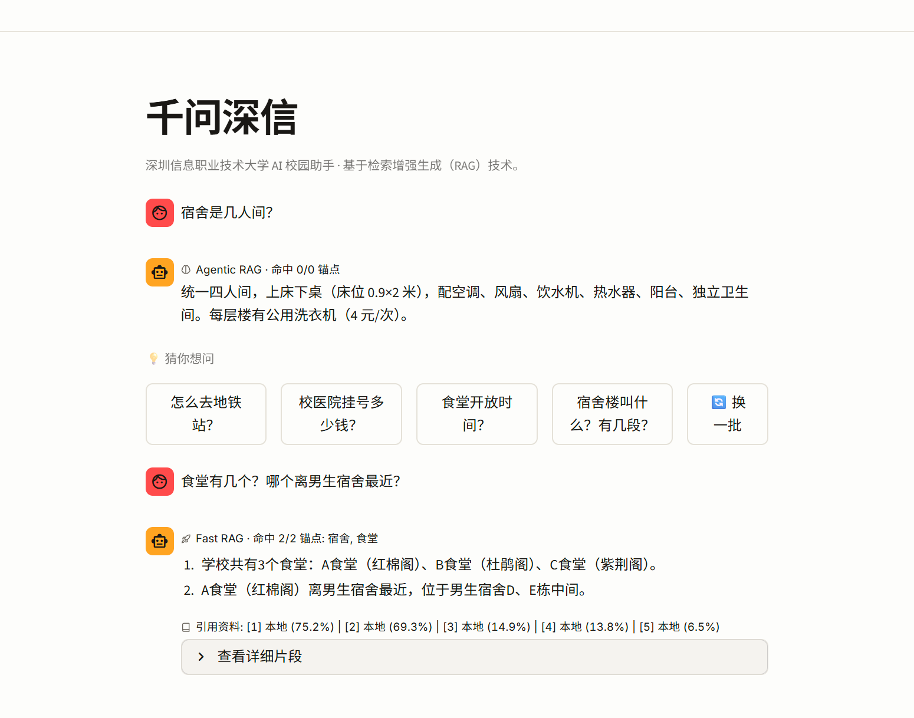
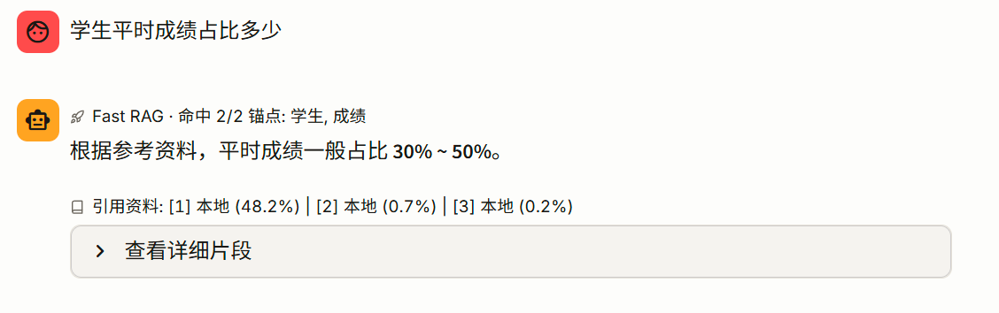
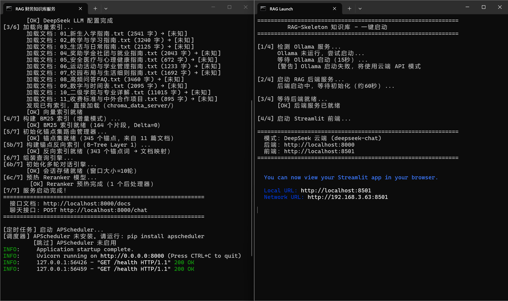

# 🏫 千问深信 — 校园智能问答助手

> **Qianwen Shenxin · Campus RAG Assistant**
>
> 基于开源 [RAG-Skeleton](https://github.com/Rhine9527123/RAG-Skeleton) 通用骨架二次开发，专为校园场景打造的智能问答系统。
>
> 📌 **2025 火山杯参赛作品**（深圳信息职业技术大学 × 字节跳动）

<p align="center">
  <a href="https://www.trae.ai"></a>
  <a href="https://www.python.org"></a>
  <a href="https://fastapi.tiangolo.com"></a>
  <a href="https://streamlit.io"></a>
  <a href="https://modelcontextprotocol.io"></a>
  <a href="https://www.llamaindex.ai"></a>
  <a href="LICENSE"></a>
</p>

---

<p align="center">
  🚀 <strong>在线体验</strong>：<a href="https://www.qwsuit.site">www.qwsuit.site</a> &nbsp;|&nbsp; 
  📖 <strong>基础骨架</strong>：<a href="https://github.com/Rhine9527123/RAG-Skeleton">RAG-Skeleton</a>
</p>

---

## 📖 项目简介

**痛点：** 每年开学，学生面临三大难题——

| 痛点 | 表现 | 后果 |
|------|------|------|
| ❌ **信息太散** | 校园信息分散在 10+ 份文档（招生简章、教学指南、收费文件、生活指南…） | 找一条答案要逐份翻阅，耗时数十分钟 |
| ❌ **通用模型答不了** | 问「深信院 A 食堂几点开」，ChatGPT 编造或说不知道 | 答案不可信，无法用于真实场景 |
| ❌ **传统搜索不够用** | 关键词搜索只返回片段，复合问题更束手无策 | 学生仍需自己拼凑答案 |

**我们的方案：** 将学校 10+ 份官方文档构建为智能知识库，学生用自然语言提问，系统自动检索、精准回答，每条答案标注来源文档。

---

## ✨ 核心亮点

### 1️⃣ 复合问题拆分（最大差异化）

> 通用大模型做不到，普通 RAG 也做不到——**我们做到了**。

**示例：** 用户问「食堂有几个？哪个离男生宿舍最近？哪个最好吃？」

| 系统 | 表现 |
|------|------|
| 通用大模型 | 🙅 只答 1 个或乱编 |
| 普通 RAG | 🙅 只答 1 个 |
| **本系统** ✅ | **拆为 3 个子问题 → 各自检索 → 合并去重 → 分点回答并各自标注来源** |

**技术路径：** 规则初判（标点/连词） + LLM 复核 → 拆分子问题 → 独立检索 → 合并去重 → 分点生成

---

### 2️⃣ 锚点判断：简单问题秒回，复杂问题精答

> 不是所有问题都值得走全套检索流程——自动分流，该快快，该慢慢。

```
用户提问
  ↓ 字符 n-gram 提取关键词
  ↓ 与知识库锚点集匹配（LSM-Tree 风格增量维护）
  ├─ 命中充足 → 🚀 Fast RAG（直接回答，~0.3 秒）
  └─ 命中不足 → 🧠 Agentic RAG（深度检索 / 追问补充）
```

| 问题类型 | 优化前 | 优化后 | 降幅 |
|---------|--------|--------|------|
| 简单问题 | 2-3 秒 | **0.3 秒** | **↓ 91%** |

锚点集维护借鉴 LSM-Tree 思想：新文档先进内存缓冲，攒够一批再合并刷盘，避免每次上传都全量重建。

---

### 3️⃣ 三段式混合检索：不漏答案

| 环节 | 技术 | 作用 | 解决什么问题 |
|------|------|------|-------------|
| 🔵 向量检索 | bge-small-zh-v1.5（语义匹配） | 理解语义，召回近义词表达 | 关键词不同但语义相近的问题 |
| 🔴 BM25 检索 | 关键词精确匹配 | 精确命中专有名词/数字/编号 | 术语/编号类精确查询 |
| 🟣 Reranker 精排 | bge-reranker-v2-m3（Cross-Encoder） | 二次排序，锁定最相关片段 | 向量距离 ≠ 语义相关性 |

**流程：** 向量 + BM25 双路并行 → QueryFusionRetriever 合并候选集 → Cross-Encoder 精排 top_n → 送 LLM 生成

---

### 4️⃣ 答案去重清理：100% 无重复

LLM 流式输出常见问题：「分点重复（1. xxx 1. xxx）」「整句重复」「前缀重复」「尾部重复」。

**方案：** 统一「非流式完整生成 → 多层去重清理 → 逐字推送」架构，从源头消除重复。

---

## 📊 效果对比

### 与通用大模型对比

| 对比维度 | 通用大模型 | 本系统 |
|---------|-----------|--------|
| 校园信息准确率 | ~60%（真假难辨） | **95%+** |
| 复合问题完整率 | ~50% | **90%+** |
| 简单问题响应 | 2-3 秒 | **0.3 秒** |
| 来源可追溯 | ❌ 不支持 | ✅ 每条答案标注文档来源 |
| 多格式输入 | 仅文本 | 文本 + PDF + Excel |

### 与普通 RAG 产品对比

| 能力 | 通用大模型 | 普通 RAG | 本系统 |
|------|-----------|---------|--------|
| 复合问题多跳 | ✗ | ✗ | **✓** |
| 秒级智能分流 | ✗ | 多数无 | **✓** |
| 来源可追溯 | ✗ | 部分 | **✓** |
| 多格式输入 | 仅文本 | 文本+PDF | **5 种格式** |

---

## 🏗️ 技术架构

```
用户（Web 浏览器 / 大模型客户端）
  ↓
① 服务层：FastAPI（30+ API 接口，异步高性能）
  ↓
② 路由层：锚点判断（n-gram + 强名词评分 + B-Tree 双层路由）
  ├─ 🚀 Fast RAG ─→ 直接检索 + 精排 + 生成
  └─ 🧠 Agentic RAG ─→ 复合问题拆分 → 多路检索 → 合并去重 → 分点生成
  ↓
③ 检索层：向量检索（bge-small-zh-v1.5）+ BM25 + QueryFusion 合并
  ↓
④ 精排层：Cross-Encoder（bge-reranker-v2-m3）二次精排
  ↓
⑤ 生成层：DeepSeek Chat（temperature=0.1，低温度防幻觉）
  ↓
⑥ 数据层：知识库文档（txt/pdf/xlsx）+ ChromaDB 向量索引 + BM25 索引
```

### 自研模块

| 模块 | 说明 |
|------|------|
| **锚点判断管理器** | 字符 n-gram 提取 + LSM-Tree 风格增量更新 + B-Tree 双层路由（O(1)查表） | `rebuild_anchors.py` |
| **强名词评分体系** | 4 层权重（strong_noun 1.0 → generic_noun 0.2）+ 三重防误判过滤 + 省略式实体补全 |
| **复合问题拆分** | 标点/连词规则初判 + LLM 复核 → 拆分子问题 → 独立检索 → 合并去重 → 分点生成 |
| **答案去重清理** | 编号截断 + 句子级语义去重（相似度 > 0.85 判定重复）+ 前缀/尾部重复检测 |
| **Reranker 跳过策略（三信号）** | kw≥0.6 AND ret_top≥0.6 AND gap≥0.05 时跳过精排，降低延迟 |

---

## 🧰 技术栈

| 层级 | 技术 |
|------|------|
| **开发工具** | Trae（字节跳动 AI IDE） | 本次比赛指定开发环境，AI 辅助编码 |
| **后端框架** | FastAPI + Python 3.10+ | 高性能异步 Web 框架 |
| **前端界面** | Streamlit |
| **RAG 框架** | LlamaIndex 0.14.x |
| **向量模型** | BAAI/bge-small-zh-v1.5（512 维，中文优化） |
| **精排模型** | BAAI/bge-reranker-v2-m3（Cross-Encoder） |
| **LLM（在线）** | DeepSeek Chat（temperature=0.1） |
| **LLM（离线）** | Ollama + Qwen2.5:7b（断网兜底） |
| **向量数据库** | ChromaDB |
| **公网部署** | Cloudflare Tunnel + `启动穿透.bat` | 稳定公网访问，无需云服务器 |
| **一键启动** | `启动.bat`（Windows） | 自动检测 Ollama → 启动后端 → 等待就绪 → 拉起前端 |
| **多端接入** | MCP 协议（Hermes / OpenClaw / Trae 等） |

---

## 🚀 快速启动

```bash
# 1. 克隆仓库
git clone https://github.com/Rhine9527123/QWSuit-Campus-RAG.git
cd QWSuit-Campus-RAG

# 2. 安装依赖
pip install -r requirements.txt

# 3. 配置 API Key（.env 文件）
# DEEPSEEK_API_KEY=sk-your-key-here

# 4. 启动后端
python server.py
# 首次启动加载模型约 60 秒，后续秒级响应

# 5. 新开终端，启动前端
streamlit run web.py --server.port 8501
```

打开浏览器访问 `http://localhost:8501` 即可使用。

> 🪟 **Windows 用户更简单**：直接双击 `启动.bat`，脚本自动完成：检测 Ollama → 启动后端 → 等待就绪 → 拉起前端。
>
> 💡 也可直接体验公网版本：**[www.qwsuit.site](https://www.qwsuit.site)**

---

## 🖼️ 效果展示

### 问答界面



界面展示「Fast RAG」锚点命中徽章、答案来源追溯（引用资料百分比）、「猜你想问」快捷推荐、「查看详细片段」展开面板。

### 精准回答与来源追溯



命中锚点后直接给出精确答案，附带引用文档及匹配度。

### 一键启动



后端启动自动加载 11 份校园文档、构建 345 个锚点词、预热模型，一键完成全部初始化。前端自动拉起 Streamlit，公网隧道同步就绪。

---

## 📁 项目结构

```
QWSuit-Campus-RAG/
├── server.py                 # FastAPI 后端（RAG 服务核心 + 路由分发）
├── web.py                     # Streamlit 前端界面（多轮对话 + 锚点徽章 + 来源追溯）
├── rebuild_anchors.py         # 锚点判断管理器（LSM-Tree + B-Tree 路由）
├── keyword_scorer.py          # 强名词评分体系（4 层权重 + 完善式追问）
├── config.py                  # 中心化配置（含校园领域预设 + 40 个预置高频问题）
├── requirements.txt           # Python 依赖清单
├── 启动.bat                   # Windows 一键启动脚本（自动检测 Ollama + 启动前后端）
├── 启动穿透.bat               # Cloudflare 隧道启动（公网访问）
├── data/                      # 校园知识库文档（共 11 份）
│   ├── metadata.json          # 元数据标签映射
│   ├── anchor_set.json        # 锚点集缓存（自动生成）
│   ├── 01_新生入学指南.txt
│   ├── 02_教学与学习指南.txt
│   ├── 03_生活与日常指南.txt
│   ├── 04_奖助学金社团与就业指南.txt
│   ├── 05_安全医疗与心理健康指南.txt
│   ├── 06_运动活动与学业管理指南.txt
│   ├── 07_校园布局与生活细则指南.txt
│   ├── 08_高频问答FAQ.txt
│   ├── 09_数字与时间表.txt
│   ├── 10_二级学院与专业详解.txt
│   └── 11_收费标准与中外合作项目.txt
├── chroma_data_server/        # 向量索引（自动生成）
└── models/                    # 本地模型缓存（自动下载）
    └── BAAI/
        ├── bge-small-zh-v1.5/
        └── bge-reranker-v2-m3/
```

---

## 📜 项目来源

本系统基于开源通用 RAG 骨架 **[RAG-Skeleton](https://github.com/Rhine9527123/RAG-Skeleton)** 二次开发。

RAG-Skeleton 是一个「即插即用」的 RAG 系统骨架——丢进知识文件 + 切换预设就是一个新应用，支持混合检索、Reranker 精排、锚点判断、双 LLM 模式等核心能力。

本参赛项目在通用骨架之上，针对校园场景进行深度定制：
- 使用 **Trae AI IDE** 完成全部开发（比赛指定开发环境）
- 新增 **复合问题拆分** 能力（规则初判 + LLM 复核）
- 新增 **答案去重清理** 流水线（非流式生成 → 多层去重 → 逐字推送）
- 配置 **校园领域预设**（含 40 个预置高频问题 + 猜你想问快捷入口）
- 部署至 **公网可访问**（Cloudflare 隧道）
- 支持 **一键启动**（Windows 批处理脚本）

---

## 📄 许可证

MIT License

---

<p align="center">
  <strong>通用大模型答不了的问题，我们来答。</strong><br>
  基于真实文档，追溯可靠来源，支持复杂问题。<br><br>
  ⭐ 如果这个项目对你有帮助，欢迎 Star！
</p>
